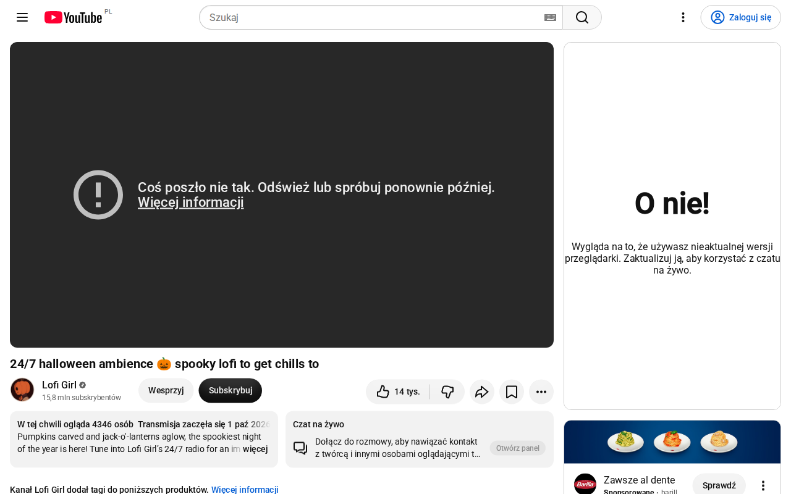

# Natywny czat — zakres draft PR #25

[Draft PR #25](https://github.com/TomaszJanusz/Theater-Mode-Everywhere/pull/25) realizuje pierwszy etap [opracowania](twitch-youtube-chat.md): zachowanie istniejącego czatu na natywnych stronach Twitch i YouTube. Zadanie: [TME-18](https://linear.app/privacybrand/issue/TME-18/czaty-twitch-i-youtube-natywna-integracja-chowanie-i-zachowanie-pelnej).

## Wspólny kod

Adaptery w `src/chat/detect.ts` wskazują `ChatSurface`: serwis, materiał, live/replay, oryginalny kontener, opcjonalną ramkę i przodków potrzebnych do prezentacji. Nie pobierają wiadomości i nie implementują funkcji konta.

`ChatController` zarządza wykrywaniem, cyklem życia, widocznością, fokusem i geometrią. `src/ui/chat.ts` łączy go z istniejącym UI i zapisem preferencji rozszerzenia. Przycisk pokaż/schowaj oraz ustawienie szerokości korzystają z tego samego kodu dla obu serwisów. Kontroler udostępnia metody `show`, `hide`, `toggle`, `setWidth`, `refresh` i `dispose`; adaptery dostarczają opis powierzchni. `ChatSurface` nie jest rendererem wiadomości ani magistralą akcji serwisowego czatu.

Panel zajmuje prawą część okna od 900 px szerokości; poniżej jest pod wideo. Szerokość prawego panelu można ustawić w zakresie 280–600 px. Wideo, toolbar, HUD i napisy korzystają z wymiarów pozostałego obszaru. Schowany kontener pozostaje w DOM, jest niewidoczny i `inert`. TME nie klonuje, nie przepina ani nie zmienia źródła ramki.

## Sposób weryfikacji rzeczywistych serwisów

Zrzuty w tym katalogu wykonano 8 października 2026 w współdzielonej przeglądarce T3, na prawdziwych stronach, bez zalogowanego konta. Do strony wstrzyknięto zbudowane `content.js`, `mainWorld.js` i `content.css`, aby zweryfikować kod TME w aktualnym DOM serwisów. To diagnostyka runtime na stronie; nie zastępuje testu zainstalowanego rozszerzenia, jego uprawnień i izolowanego świata.

### Twitch

Materiał: [ohnePixel live](https://www.twitch.tv/ohnepixel). Natywny czat zawierał rzeczywiste wiadomości, emotes, badges i przypiętą wiadomość.

- Panel czatu oraz player zajmowały rozłączne obszary.
- Schowanie oddawało playerowi całe okno; pokazanie zachowywało tożsamość kontenera i jego rodzica.
- Natywne menu Chat Settings otwierało się nad playerem.
- Przy oknie 800 × 800 czat zajmował obszar pod wideo.
- Nie wysłano wiadomości, nie wykonano zakupu ani działania moderacyjnego.

### YouTube

Materiał: [Lofi Girl — transmisja live](https://www.youtube.com/watch?v=1-LpQekNa9g). **Już przed uruchomieniem TME** YouTube zwracał błąd playera i komunikat w ramce czatu „Wygląda na to, że używasz nieaktualnej wersji przeglądarki”. Przeglądarka przedstawiała się jako HeadlessChrome 154. Ten zrzut dokumentuje ograniczenie środowiska; nie potwierdza działania wiadomości ani logowania.

Aktualny DOM zawierał `ytd-live-chat-frame#chat` i `iframe#chatframe` bez atrybutu `src`; dokument ramki miał adres `live_chat` z continuation. Ten wariant wymaga detekcji komponentu powiązanego z bieżącym `video-id`, zamiast polegania wyłącznie na `iframe.src`.

Po wstrzyknięciu kodu potwierdzono geometrię istniejącego panelu oraz zachowanie tożsamości kontenera, rodzica, ramki i jej dokumentu, bez dodatkowego `load` i bez dodania `src`. Diagnostyka nie doprowadziła do pełnego działającego UI TME na tej stronie; pojawiła się też reklama przed materiałem. Przycisk czatu i funkcje wiadomości na prawdziwym YouTube nie są zatem oznaczone jako zweryfikowane. Testy przycisku, zachowania draftu i skrótów przeprowadzono na fixtures.

## Co pozostaje do kwalifikacji przed wydaniem

Weryfikacja automatyczna:

- `pnpm typecheck`, `pnpm build`, `pnpm verify:bundles`: sukces.
- 21 nowych testów kontraktu i sesji czatu: sukces, bez pominiętych testów.
- `pnpm test`: 473/474. Test Netflixa `boots at document_start and uses the attached signed-in session…` kończy się timeoutem w `src/ui/netflix-runtime.browser.test.ts:476`. Identyczny wynik odtworzono w osobnym katalogu na bazowym commicie `a79a5417b42ec6ea27b5f339afbd16714b14bee3`; nie jest to regresja czatu.
- Chromium smoke: sukces dla zainstalowanej paczki rozszerzenia. Weryfikuje istniejące przepływy playera i fullscreen na lokalnych fixtures.
- Firefox smoke: diagnostyka z wstrzykniętych paczek; Playwright nie ładuje niepodpisanego dodatku MV3. Nie stanowi kwalifikacji uprawnień ani natywnego czatu Firefox.

Automatyczne fixtures sprawdzają mechanikę rozszerzenia: cykl życia, tożsamość ramki, brak dodatkowego load, szkic wiadomości, skróty, IME, fokus i odzyskanie układu. Nie potwierdzają serwisowych funkcji.

Przed wydaniem nadal trzeba sprawdzić działający YouTube w obsługiwanej przeglądarce, oba serwisy na zalogowanym koncie, moderację, natywne formularze monetyzacji, live/Premiere i rzeczywisty replay, fullscreen oraz Chrome i Firefox z zainstalowanym rozszerzeniem. Faktycznych płatności nie deklarujemy jako zweryfikowanych. Nowe embedy i integracja czatu obok playera na dowolnej stronie zewnętrznej pozostają osobnym etapem.

Zmiany DOM serwisów nie mają stabilnego kontraktu. Testy i zachowanie oryginalnej sesji ograniczają ryzyko, ale nie dają gwarancji zgodności z każdą przyszłą aktualizacją.
