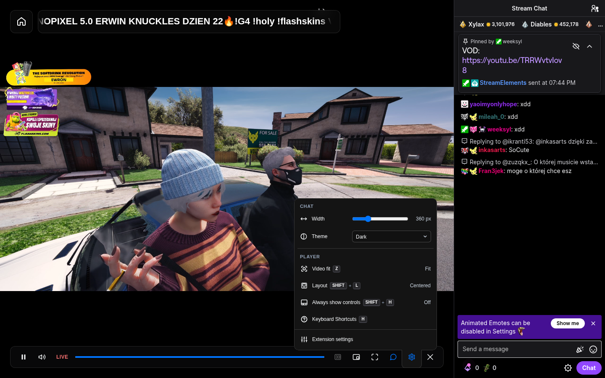
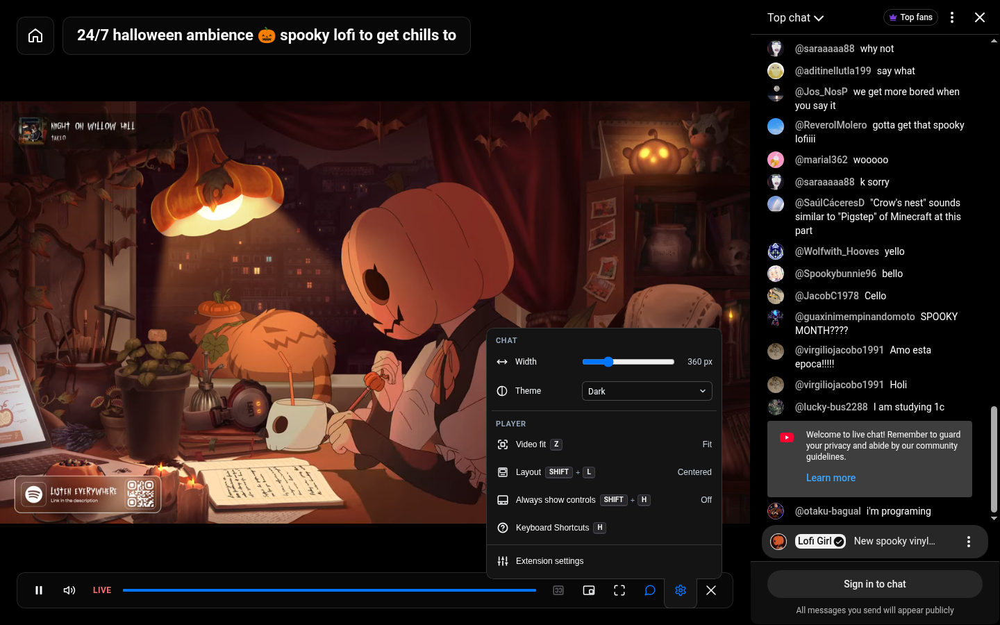
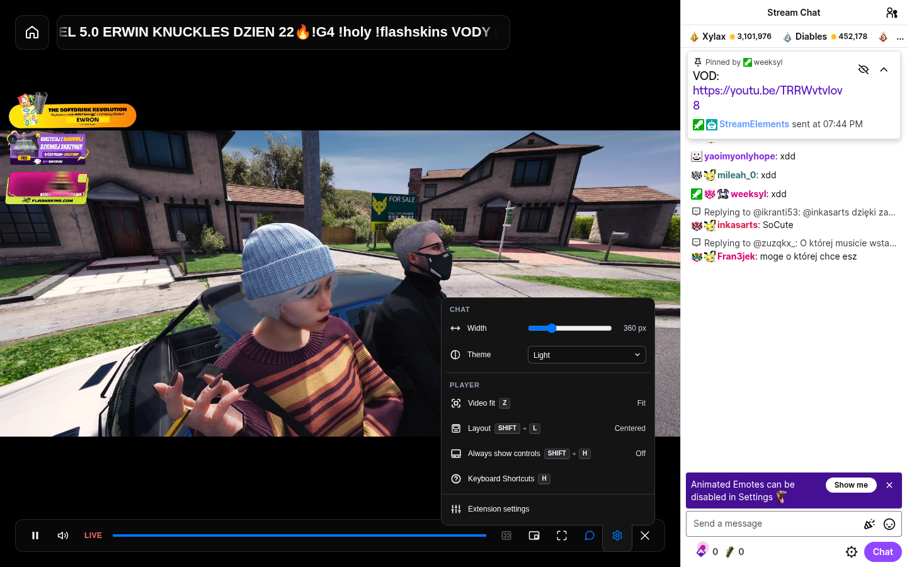
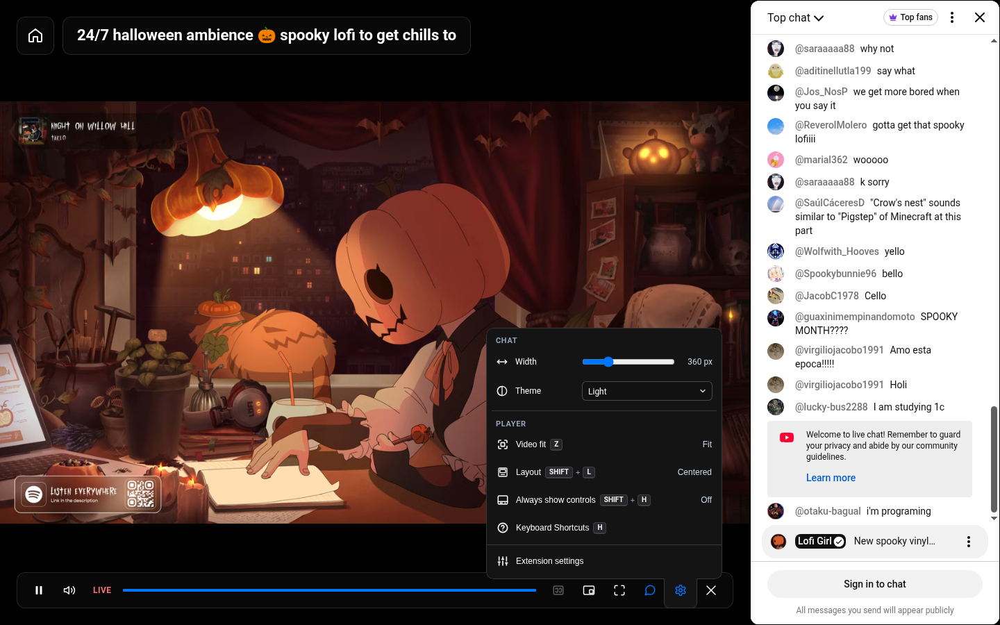
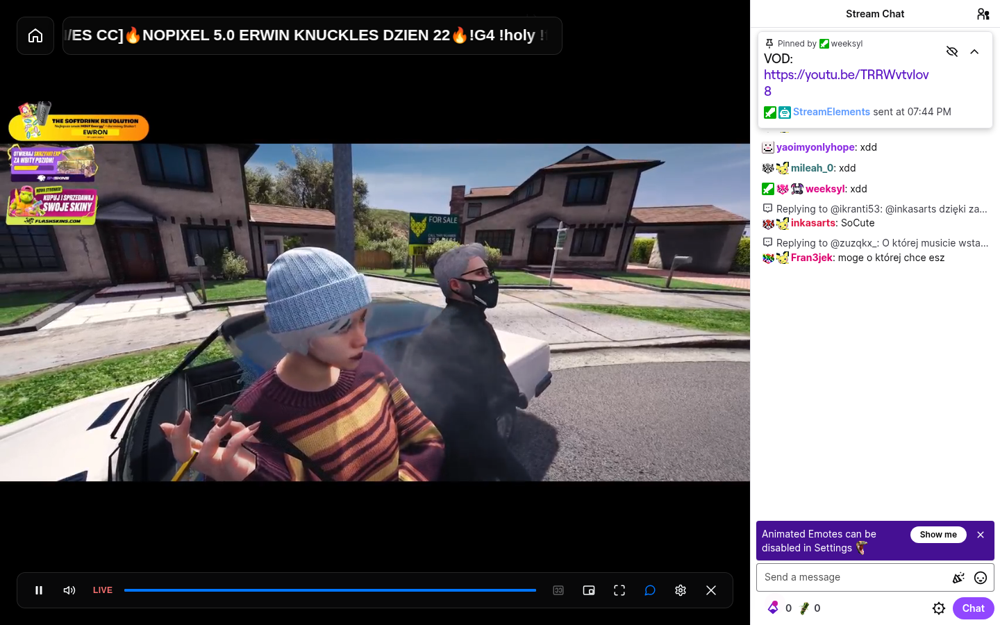
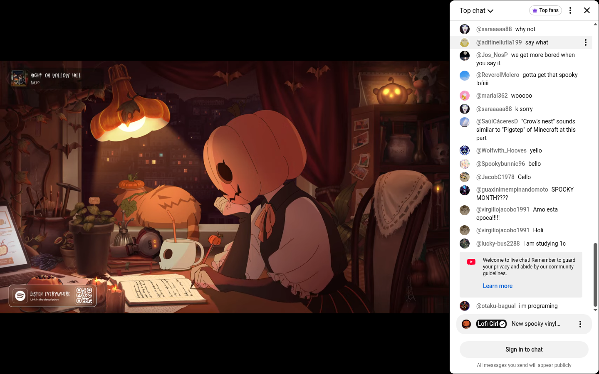
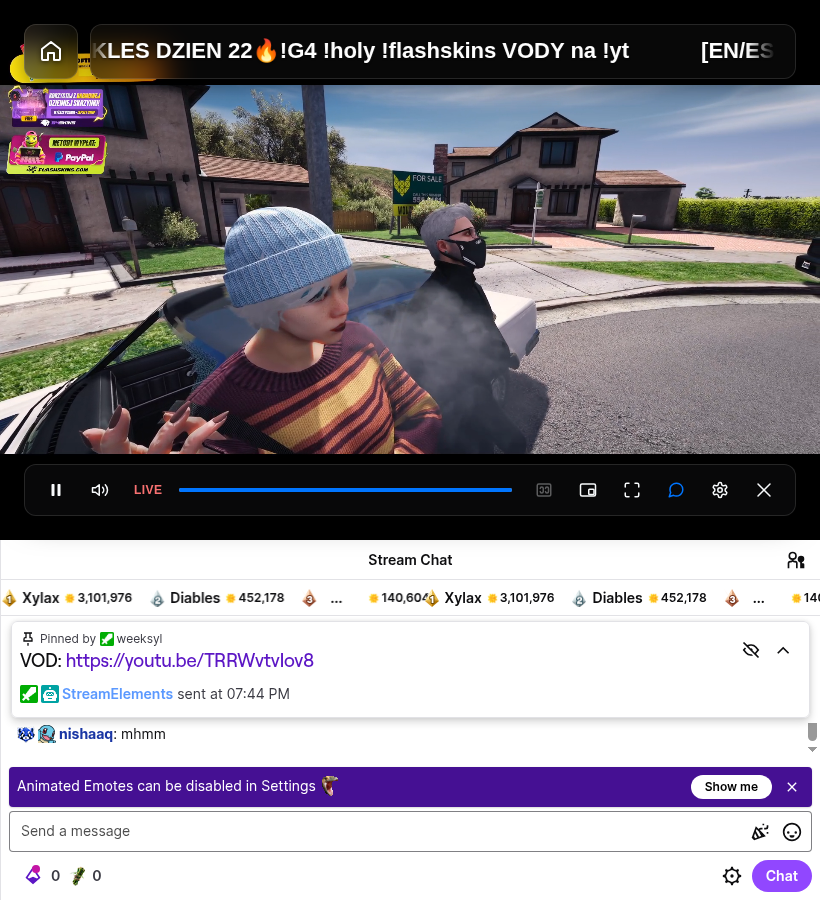
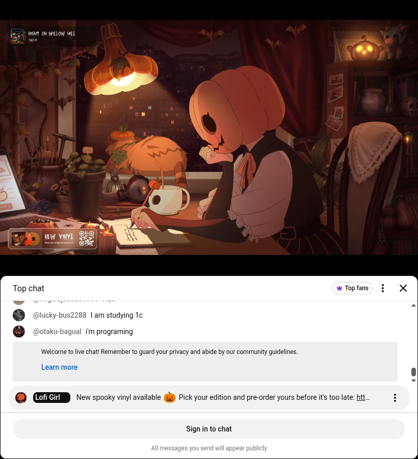

# Natywny czat — implementacja i walidacja PR #25

[PR #25](https://github.com/TomaszJanusz/Theater-Mode-Everywhere/pull/25) zachowuje oryginalny czat Twitcha i YouTube, dodaje chowanie, regulację szerokości i niezależny motyw. Zadanie: [TME-18](https://linear.app/privacybrand/issue/TME-18/czaty-twitch-i-youtube-natywna-integracja-chowanie-i-zachowanie-pelnej). [Opracowanie architektury](twitch-youtube-chat.md) opisuje też osobny etap embedów na stronach zewnętrznych.

Stan: 9 października 2026, kod `fcc8f2a`. PR pozostaje otwarty do review; funkcja nie została jeszcze wydana.

## Obsługa

- Przycisk czatu i domyślny skrót **Alt+R** pokazują lub chowają panel. Pomoc, tooltip i edytor skrótów używają wspólnego ustawienia. Zapisane własne skróty użytkownika są zachowane.
- Ustawienia mają sekcję **CHAT** nad **PLAYER**, ikony szerokości/motywu i aktywną ikonę czatu w kolorze akcentu. Tło playera jest czarne. Motywy: **Jasny / Ustawienia serwisu / Ciemny**, niezależnie od wyglądu strony.
- Od 900 px szerokości okna panel jest po prawej: domyślnie 360 px, zakres 280–600 px. Poniżej znajduje się pod wideo, bez suwaka szerokości. Przy schowanym czacie wideo zajmuje cały obszar; suwak jest nieaktywny, wybór motywu dostępny.
- Bez zapisanego wyboru TME respektuje zastaną widoczność. Brak dostępnego czatu oznacza ukryte kontrolki. Przy nierozpoznanej palecie pozostaje motyw serwisu z wyjaśnieniem; preferencja jest zapamiętana.
- TME nie zmienia filtra Top chat/Live chat ani nie tworzy zastępczego iframe. Chowanie nie usuwa komponentu; odbieranie wiadomości w tle nadal zależy od serwisu i przeglądarki. Video PiP obejmuje samo wideo.

## Otwieranie czatu zwiniętego przez widza

Detekcja aktywatora jest niezależna od detekcji gotowego panelu: `available` może być prawdziwe przy `surface === null`. Do pojawienia się panelu wideo zachowuje pełną szerokość.

- **YouTube:** adapter sprawdza bieżący identyfikator `ytd-watch-flexy`, rozpoznany tytuł boksu `yt-video-metadata-carousel-view-model` pod filmem i aktywną kontrolkę otwarcia. Starszy wariant korzysta z `#show-hide-button`. Obcy film, inna karta i wyłączona kontrolka nie są aktywatorami. Pusty iframe z natywnym komunikatem niedostępności replay nie jest panelem czatu. Rozpoznawane są także polskie boksy „Ponowne odtwarzanie czatu na żywo”. Lista tytułów kart jest ograniczona językowo; nieznany wariant bez alternatywnego przycisku pozostaje niewykryty.
- **Twitch:** adapter wykrywa natywną kontrolkę rozwijania oraz zwiniętą strukturę prawej kolumny. W VOD używa oryginalnego `.video-chat`; live używa komponentu chat-room. Replay nie jest zastępowany bieżącym czatem kanału.
- **Kontroler:** uruchamia jedno natywne kliknięcie na próbę i materiał, czeka na DOM serwisu i pozwala anulować lub jawnie ponowić próbę. Zapisane `visible: true` może uruchomić aktywator. Natywne zamknięcie jest respektowane. Kolejne chowanie/pokazywanie zachowuje komponent.

Dotyczy to czatu zwiniętego przez widza. TME nie włącza czatu wyłączonego przez twórcę lub niedostępnego dla materiału/konta.

## Preferencje i cykl życia

`src/ui/chat.ts` zapisuje `visible`, `width` i `theme` pod kluczem `nativeChatPreferences` w `chrome.storage.sync`, osobno dla `twitch` i `youtube`. Zmiany są grupowane przez 350 ms; oczekujący zapis jest wysyłany przy zakończeniu sesji i `pagehide`. Brak lub nieprawidłowy motyw w starszych preferencjach daje `native`, bez zapisu migracyjnego podczas samego odczytu. TME nie zapisuje wiadomości, szkiców ani danych konta; szkic pozostaje w edytorze serwisu.

Runtime playera uruchamia i kończy wspólną sesję czatu podczas wejścia i wyjścia z theater. Kontroler obserwuje strukturę strony i odpytuje tożsamość trasy co 500 ms; dopisywanie wiadomości wewnątrz zachowanego komponentu nie powoduje ponownego wykrywania. Zmiany viewportu są grupowane przez `requestAnimationFrame`. Sesja motywu co 700 ms sprawdza gotowość i tożsamość dokumentu; przy jego wymianie odtwarza stan starego adaptera i tworzy nowy snapshot dla nowego dokumentu. Wyjście odłącza obserwatory/timery i przywraca własne zmiany DOM/CSS. Obsługa zdarzeń pomija natywny czat, jego portale oraz samodzielne dokumenty czatu w światach MAIN i isolated.

## Wspólny kod i adaptery

Adaptery detekcji w `src/chat/detect.ts` wskazują `ChatSurface`: oryginalny kontener, istniejącą ramkę, serwis, materiał, live/replay i przodków potrzebnych do prezentacji. Wiadomości i funkcje konta nadal obsługuje serwis. `ChatSurface` jest opisem istniejącego czatu, a nie rendererem wiadomości ani magistralą jego akcji.

Wspólny `ChatController` obsługuje widoczność, szerokość, układ, fokus i cykl życia. `src/ui/chat.ts` zapewnia jednakowe UI i zapis preferencji osobno dla Twitcha i YouTube. Panel jest po prawej od 900 px szerokości okna; poniżej znajduje się pod wideo. Szerokość bocznego panelu wynosi 280–600 px. Player, toolbar, HUD i napisy korzystają z pozostałego obszaru. Schowany kontener pozostaje w DOM, jest niewidoczny i `inert`.

`ChatThemeSession` wspólnie obsługuje zastosowanie wyboru, gotowość dokumentu, wymianę ramki, ponowne sprawdzenie palety oraz przywracanie zmian po wyborze „Ustawienia serwisu” lub wyjściu z TME. Dwa adaptery palety implementują ten sam kontrakt `apply(theme)` / `restore()`:

| Serwis | Jak stosowana jest paleta |
| --- | --- |
| Twitch | Adapter znajduje kompletną klasę natywnych tokenów w aktualnym CSS. Stosuje ją do czatu i portali oraz przełącza natywne flagi jasnego/ciemnego wyglądu. Wygenerowana nazwa klasy nie jest zapisana w TME. |
| YouTube | Adapter zmienia `dark` tylko w istniejącym dokumencie czatu i dodaje własny, usuwalny arkusz łączący 57 skompilowanych aliasów z natywnymi tokenami palety. Nie pobiera przeciwnego arkusza ani nie wywołuje lub podmienia funkcji YouTube. |

Oba serwisy mają aktywny przełącznik, również przy schowanym czacie i dolnym panelu. Wybór nie zmienia zapisanych ustawień wyglądu serwisu. Jeśli adapter nie rozpozna potrzebnej palety, usuwa wymuszenie i pozostawia natywny wygląd z wyjaśnieniem w UI; preferencja użytkownika pozostaje zachowana.

YouTube nie ma publicznego kontraktu tych aliasów. Rozpoznawanie sprawdza obecność obu palet, wymagane deklaracje i odwołania do znanych aliasów w CSS, także w deklaracjach skrótowych, oraz obsługę `color-mix`. Pełny odczyt aktualnego CSS wykazał **68 używanych aliasów: 57 różnic między motywami i 11 stałych kolorów**. Most nie zawiera własnych RGB/hex; jeden dawny token dla linii wątku jest odczytywany z natywnej jasnej deklaracji, którą nowy system YouTube nadpisuje na korzeniu. [Historia prototypów](youtube-chat-theme-patch.md) wyjaśnia wcześniejszy, niepełny pomiar 47/38.

## Warstwy i natywne menu

Natywne portale i dialogi mają warstwę nad TME. Obniżono warstwę playera i chrome TME tylko w sesji z wykrytym czatem. W łańcuchu przodków usuwane są także konteksty tworzone przez `view-transition-name` YouTube; samo `z-index: auto` nie wystarczało. CSS działa wyłącznie podczas TME i przywraca natywną prezentację po wyjściu. Wyłączane są animacje zewnętrznych przodków czatu: YouTube w fullscreen zachowuje animację `slide-in` z `animation-fill-mode: forwards`, która potrafi utrzymać kontekst pozycjonowania nawet przy nadpisanym `transform: none`. Test geometrii zawiera taki przodek; wyjście przywraca natywną animację. W wąskim układzie YouTube przenosi czat pod `#below`; ten przodek jest ujawniany tylko wtedy, gdy faktycznie zawiera wykryty czat. Fixture przenosi natywny kontener w obie strony i sprawdza geometrię, widoczność przodka oraz zachowanie dokumentu i szkicu.

Transport `fetch` Twitcha pozostaje nienaruszony. Próba z rzeczywistym dodatkiem wykazała zamrożenie wiadomości replay po seeku także poza theater; przywrócenie samego natywnego `fetch` usunęło problem. TME nie opakowuje już `window.fetch` na Twitchu. Odczyt metadanych nadal korzysta z obserwacji odpowiedzi JSON/text i XHR. Test sprawdza zachowanie tożsamości funkcji, późniejszych podmian transportu, dodatkowych metod obietnicy i zbierania czasu trwania nagrania. Nie wywołuje prywatnego API playera.

Test przeglądarkowy umieszcza portale Twitcha, popup YouTube i dialog z backdropem **przed** hostem TME, nakłada je na jego przycisk ustawień i wideo, a następnie sprawdza trafienie i rzeczywiste kliknięcie. Osobny odczyt pikseli ramki wykrywa sytuację, w której czat istnieje i przyjmuje kliknięcia, ale pozostaje namalowany pod czarną sceną.

## Bieżące dowody

Kwalifikację uruchamia [skrypt](prototypes/native-chat-opening.mjs) po `pnpm build`:

```sh
xvfb-run --auto-servernum node docs/research/prototypes/native-chat-opening.mjs chromium
xvfb-run --auto-servernum node docs/research/prototypes/native-chat-opening.mjs firefox
xvfb-run --auto-servernum node docs/research/prototypes/native-chat-opening.mjs chromium replay
xvfb-run --auto-servernum node docs/research/prototypes/native-chat-opening.mjs firefox replay
xvfb-run --auto-servernum node docs/research/prototypes/native-chat-opening.mjs chromium youtube-replay https://www.youtube.com/watch?v=ORf39npHolQ
```

Każda próba używa osobnego wylogowanego profilu. Testowy Firefox dopuszcza autoplay, aby serwis mógł wznowić wideo po zmianie swojego playera; ta konfiguracja jest zapisana w raporcie. Chromium ładuje `dist/chrome-unpacked`; Firefox instaluje rzeczywisty tymczasowy dodatek przez lokalny protokół debugowania, tak jak Mozilla web-ext ([helper](prototypes/firefox-addon.mjs)). Nie jest to wstrzykiwanie paczki do strony. Raporty zapisują commit, wersję przeglądarki, hashe trzech paczek oraz pomiary geometrii i tożsamości. Kontrola pikseli wykrywa czat zasłonięty czarnym tłem; samo istnienie DOM i hit testing nie wystarczają.

| Próba na prawdziwym serwisie | Wynik i dowód |
| --- | --- |
| YouTube Live + Twitch live, Chromium 153 | Otwarcie natywnie zwiniętego czatu, Alt+R hide/show, obie palety, fullscreen dokumentu, dolny panel 820 × 900 i powrót do bocznego, filtr YouTube: sukces. [Raport](screenshots/current/native-chat-final-chromium.json), kod `fcc8f2a`. |
| Te same przebiegi, Firefox 155 z rzeczywistym dodatkiem | Sukces w testowym profilu dopuszczającym autoplay. [Raport](screenshots/current/native-chat-final-firefox.json), kod `fcc8f2a`. |
| Archiwalny live YouTube, Chess.com `ORf39npHolQ`, Chromium | Top chat replay → Live chat replay, Alt+R hide/show i dwa przewinięcia paskiem TME: sukces; wiadomości zmieniają się, oryginalna ramka pozostaje. [Raport](screenshots/current/native-chat-youtube-replay-chromium-ORf39npHolQ.json), kod `fcc8f2a`. |
| Starsze archiwum YouTube, Chess.com `3AMz71cx5V8`, Chromium | Filtr, hide/show i zmiana wiadomości przy dwóch seekach: sukces. Ta wcześniejsza próba zmieniała czas bezpośrednio w elemencie wideo. [Raport](screenshots/current/native-chat-youtube-replay-chromium-3AMz71cx5V8.json). |
| Archiwalna Premiere, BLACKPINK GO `2GJfWMYCWY0`, Chromium | Natywny replay, filtr, hide/show i dwa przewinięcia paskiem TME: sukces. To archiwum premiery z 27 lutego 2026, nie aktywna Premiere. [Raport](screenshots/current/native-chat-youtube-replay-chromium-2GJfWMYCWY0.json). |
| Archiwum YouTube z wyłączonym replay, Google I/O `wYSncx9zLIU` | Natywny komunikat niedostępności; TME nie pokazuje kontrolek nieistniejącego czatu. [Raport](screenshots/current/native-chat-replay-chromium.json). |
| Archiwum YouTube `ORf39npHolQ`, Firefox | Niepełna kwalifikacja: filtr i ramka działały w części prób, ale seek nie kończył buforowania. Natywny pasek bez rozszerzenia również pozostawał w buforowaniu po 10 sekundach; nie dowodzi to wspólnej przyczyny obu przebiegów. [Próba TME, kod `dc70178`](screenshots/current/native-chat-youtube-replay-firefox-ORf39npHolQ.json), [porównanie natywne](screenshots/current/firefox-native-youtube-replay-baseline.json), [skrypt](prototypes/youtube-replay-baseline.mjs). Nie jest to zaliczony test synchronizacji. |
| Twitch VOD `2885653163`, Chromium i Firefox z rzeczywistym dodatkiem | Dwa przewinięcia paskiem TME, aktualizacja wiadomości i ich czasu, Alt+R hide/show z zachowaniem komponentu: sukces. [Chromium](screenshots/current/native-chat-replay-chromium.json), [Firefox](screenshots/current/native-chat-replay-firefox.json), kod `fcc8f2a`. |

**Różnice archiwów YouTube.** Ramka ma ścieżkę `live_chat_replay`, filtry zawierają „replay”, a wiadomości zależą od czasu filmu. Archiwum może nie udostępniać replay mimo pozostawionego pustego iframe. Polski boks otwarcia używa „Ponowne odtwarzanie czatu na żywo”. TME zachowuje oryginalny tryb i nie tworzy czatu live w jego miejsce.

Hide/show TME nie powodował dodatkowych load w sprawdzonych przebiegach live. Sam YouTube potrafił przeładować dokument przy własnej zmianie fullscreen lub układu strony; raporty rozróżniają te momenty. Zachowanie ramki przez hide/show nie oznacza, że serwis nigdy nie wymieni jej dokumentu.

| Bieżący widok | Twitch | YouTube |
| --- | --- | --- |
| Menu, ciemny czat |  |  |
| Menu, jasny czat |  |  |
| Otwarty natywnie zwinięty czat |  |  |
| Dolny panel, 820 × 900 |  |  |

Aktualna strzałka select ma odstęp 8 px i padding końcowy 28 px. Zrzuty bez sufiksu przeglądarki, [pierwsza walidacja palet](screenshots/current/verification.json) i [poprzednie odświeżenie opcji](screenshots/current/options-refresh-verification.json) są materiałem historycznym. Pokazują wcześniejsze UI i odstęp 12 px / padding 36 px; nie są bieżącą galerią. Tamte próby sprawdziły także natywne menu Twitcha, picker emotes, portal Chat Rules, menu YouTube, 68 aliasów palety i zachowanie szkicu Twitcha.

## Testy i granice zakresu

- **487/487 testów**, 88 suites, bez pominięć; typecheck, build i weryfikacja paczek: sukces dla `fcc8f2a`.
- Chromium smoke z zainstalowanym rozszerzeniem: sukces. Firefox smoke: sukces jako diagnostyka wstrzykniętych paczek; osobna powyższa kwalifikacja serwisowa używa rzeczywistego dodatku.
- Smoke uwzględnia 23 skróty w responsywnej pomocy, mierzy pierwszą widoczną akcję przy ukrytej sekcji czatu oraz czeka na zakończenie animacji przed porównaniem pozycji ikony.
- Fixtures obejmują otwarcie bez istniejącego iframe, aktywator pojawiający się później, zapisane preferencje, anulowanie i ponowienie, natywne zamknięcie, niedostępny replay YouTube i odrębny komponent replay Twitcha. Sprawdzają też kontrast edytora, szkic/IME, wymianę dokumentu, fallback palety i jego odzyskanie.
- Zgodnie z decyzją użytkownika **zalogowany edytor YouTube, moderacja i formularze konta/monetyzacji są poza zakresem tego zadania**. Nie są oznaczone jako sprawdzone ani jako blokery PR. Nie wysyłano wiadomości i nie wykonywano działań na kontach.
- Galeria Firefox ujawnia osobne ograniczenie istniejącego zegara playera Twitch live: skończony, bardzo duży czas trwania z elementu wideo jest wyświetlany jak VOD. Kod klasyfikacji timeline nie zmieniał się w tym uzupełnieniu PR; kwalifikacja live powyżej dotyczy czatu, odtwarzania i układu, nie poprawności tego zegara.
- Aktywna lub zaplanowana Premiere nie została sprawdzona. Archiwalna Premiere jest osobnym, zaliczonym przypadkiem w Chromium. Pełnego seek/replay YouTube w Firefox nie oznaczono jako zaliczonego.

Zachowanie natywnego DOM ogranicza ingerencję, lecz nie gwarantuje każdej funkcji ani zgodności z przyszłymi zmianami prywatnego DOM/CSS serwisów.
