# Natywny czat — zakres draft PR #25

[Draft PR #25](https://github.com/TomaszJanusz/Theater-Mode-Everywhere/pull/25) realizuje pierwszy etap [opracowania](twitch-youtube-chat.md): zachowanie istniejącego czatu na natywnych stronach Twitch i YouTube. Zadanie: [TME-18](https://linear.app/privacybrand/issue/TME-18/czaty-twitch-i-youtube-natywna-integracja-chowanie-i-zachowanie-pelnej).

## Wspólny kod

Adaptery w `src/chat/detect.ts` wskazują `ChatSurface`: serwis, materiał, live/replay, oryginalny kontener, opcjonalną ramkę i przodków potrzebnych do prezentacji. Nie pobierają wiadomości i nie implementują funkcji konta.

`ChatController` zarządza wykrywaniem, cyklem życia, widocznością, fokusem i geometrią. `src/ui/chat.ts` łączy go z istniejącym UI i zapisem preferencji rozszerzenia. Przycisk pokaż/schowaj oraz ustawienie szerokości korzystają z tego samego kodu dla obu serwisów. Kontroler udostępnia metody `show`, `hide`, `toggle`, `setWidth`, `refresh` i `dispose`; adaptery dostarczają opis powierzchni. `ChatSurface` nie jest rendererem wiadomości ani magistralą akcji serwisowego czatu.

Panel zajmuje prawą część okna od 900 px szerokości; poniżej jest pod wideo. Szerokość prawego panelu można ustawić w zakresie 280–600 px. Wideo, toolbar, HUD i napisy korzystają z wymiarów pozostałego obszaru. Schowany kontener pozostaje w DOM, jest niewidoczny i `inert`. TME nie klonuje, nie przepina ani nie zmienia źródła ramki.

## Weryfikacja Twitcha w przeglądarce T3

Zrzuty w tym katalogu wykonano 8 października 2026 w współdzielonej przeglądarce T3, na prawdziwej stronie Twitch, bez zalogowanego konta. Do strony wstrzyknięto zbudowane `content.js`, `mainWorld.js` i `content.css`, aby zweryfikować kod TME w aktualnym DOM serwisów. To diagnostyka runtime na stronie; nie zastępuje testu zainstalowanego rozszerzenia, jego uprawnień i izolowanego świata.

### Twitch

Materiał: [ohnePixel live](https://www.twitch.tv/ohnepixel). Natywny czat zawierał rzeczywiste wiadomości, emotes, badges i przypiętą wiadomość.

- Panel czatu oraz player zajmowały rozłączne obszary.
- Schowanie oddawało playerowi całe okno; pokazanie zachowywało tożsamość kontenera i jego rodzica.
- Natywne menu Chat Settings otwierało się nad playerem.
- Przy oknie 800 × 800 czat zajmował obszar pod wideo.
- Nie wysłano wiadomości, nie wykonano zakupu ani działania moderacyjnego.

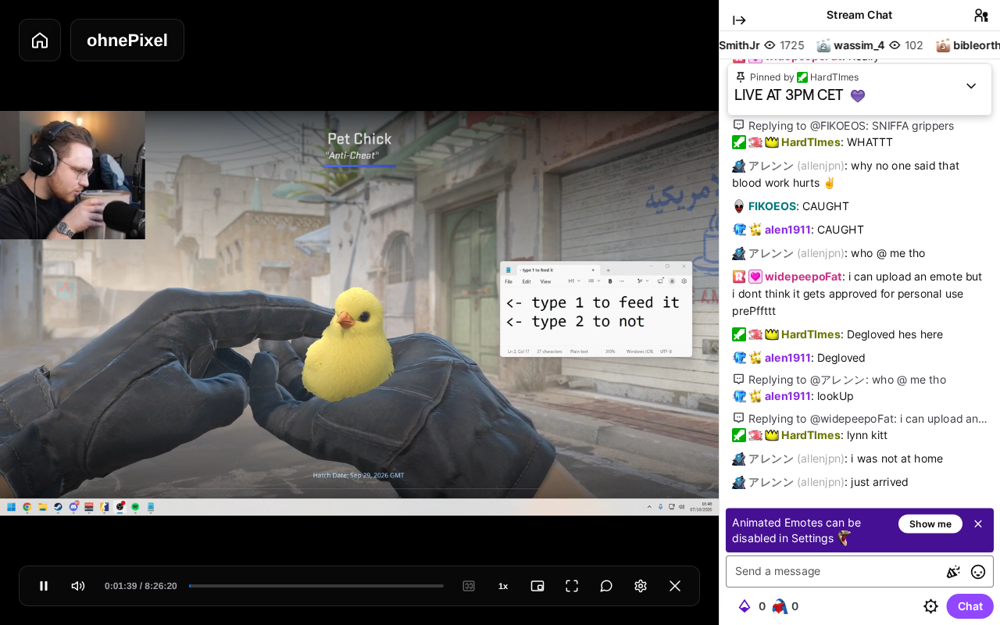

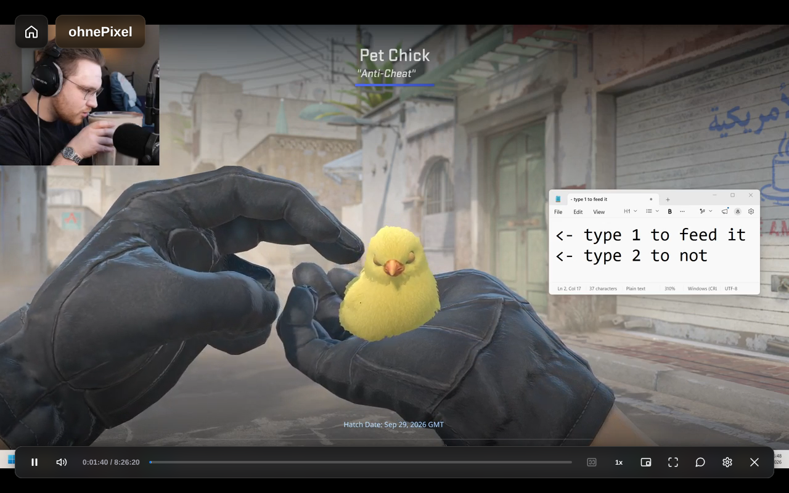

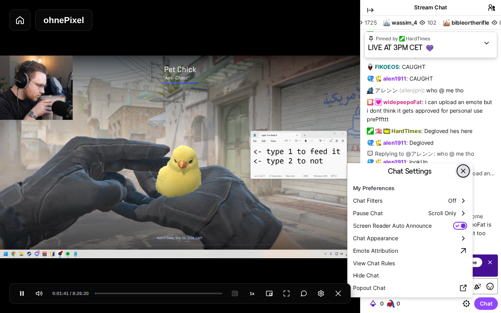

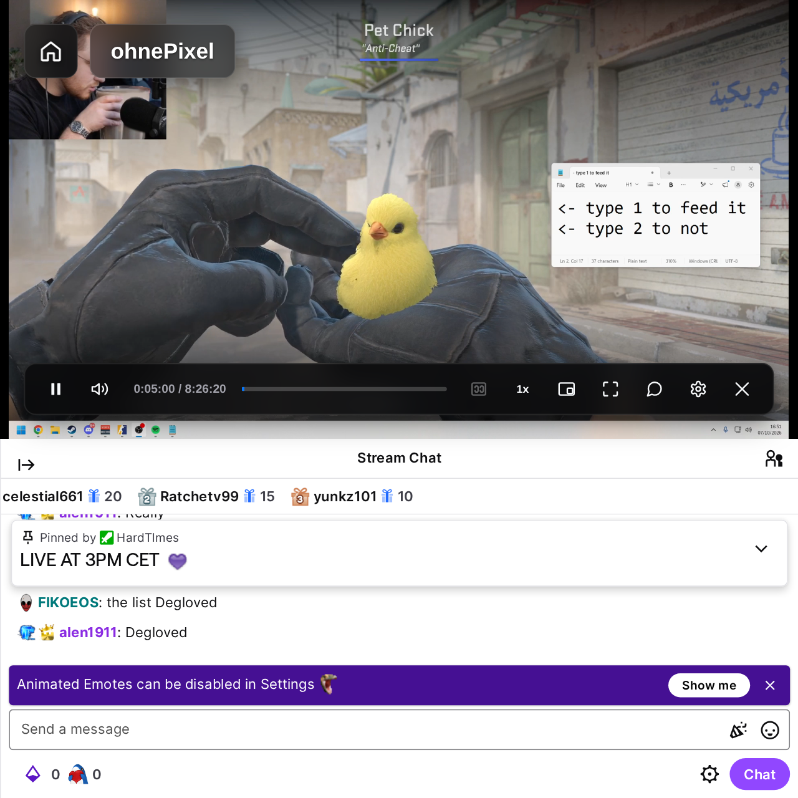

## YouTube w osobnym Playwright

Materiał: [Lofi Girl — transmisja live](https://www.youtube.com/watch?v=1-LpQekNa9g). Test na prawdziwej stronie w Chromium 153, uruchomionym w trybie graficznym przez Playwright/Xvfb, z osobnym tymczasowym profilem i zainstalowanym `dist/chrome-unpacked`. Nie wstrzykiwano paczek w stronę; użyto normalnych content scripts rozszerzenia. Sesja wylogowana, odrzucono opcjonalne cookies.

- Natywny czat wyświetlał rzeczywiste wiadomości, a wideo odtwarzało się przed i po wejściu do TME.
- UI TME i przycisk czatu działały. W oknie 1440 × 900 wideo zajmowało 1080 × 900, a czat pozostałe 360 × 900.
- Przycisk chował czat, oddawał wideo całe okno i ponownie pokazywał ten sam kontener oraz iframe. Kontener, rodzic, ramka, dokument i brak `src` pozostały bez zmian; licznik `load` dla hide/show wyniósł 0.
- Natywne menu Top chat otwierało się bez zatrzymania wideo i udostępniało opcję Live chat.
- Zrzuty poniżej potwierdzają boczny układ i chowanie. Pełny przebieg zmiany filtra oraz responsywny układ YouTube pozostają do kwalifikacji: późniejsza próba filtra i resize zakończyła się przeładowaniem dokumentu czatu; nie przypisano przyczyny TME ani serwisowi.
- Nie logowano się, nie wysłano wiadomości, nie wykonano zakupu ani działania moderacyjnego.

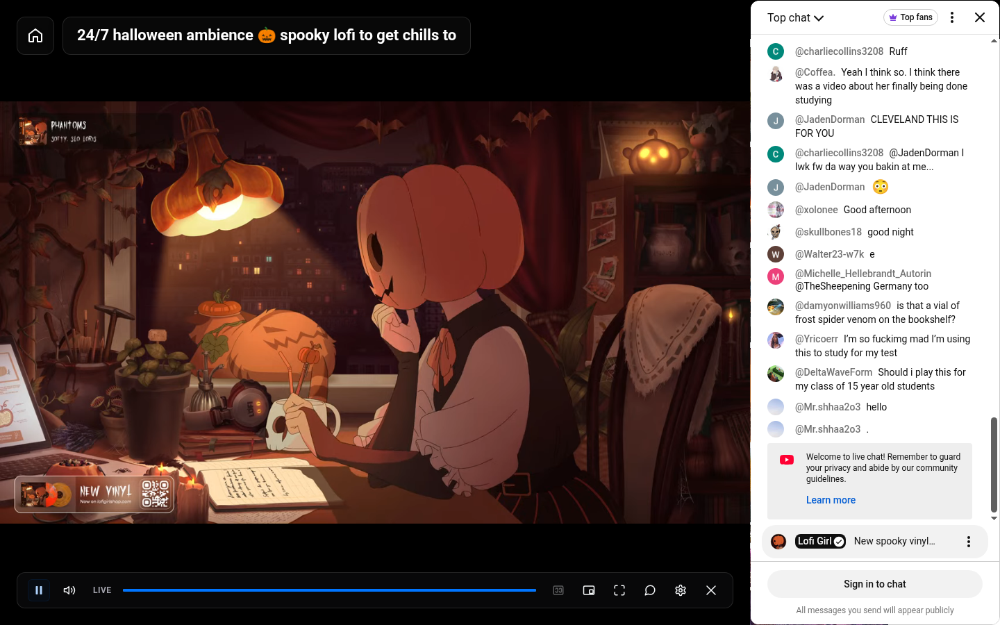

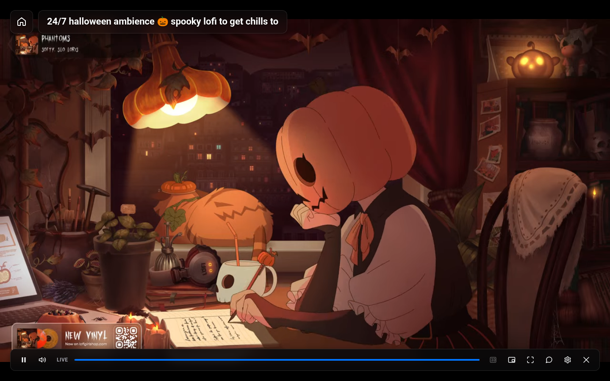

## Motyw czatu i kontrast

Na Twitchu opcje „Jasny / Ustawienia serwisu / Ciemny” są aktywne podczas sesji TME, także przy schowanym czacie i dolnym panelu. Adapter wyszukuje pełną klasę palety w aktualnym CSS Twitcha oraz przełącza natywne flagi wyglądu kontenera i portali. Nie ma własnej listy kolorów ani podmian funkcji serwisu. Jeśli arkusza nie można odczytać lub palety rozpoznać, czat zachowuje natywny wygląd. Wygenerowana nazwa klasy nie jest zapisana w kodzie.

Ponowny test na [caedrel](https://www.twitch.tv/caedrel), Chromium 153 przez Playwright/Xvfb z zainstalowanym rozszerzeniem, obejmował wpisany, niewysłany szkic „TME — test kontrastu tekstu”, menu Chat Settings oraz przełączenie dark → light → service settings. T3 utracił dostęp do hosta automatyzacji podczas tej sesji, więc wykorzystano osobną przeglądarkę. Oryginalny kontener, edytor i szkic pozostały zachowane. Wariant ciemny: pole `rgb(24, 24, 27)`, tekst `rgb(239, 239, 241)`; jasny: pole `rgb(255, 255, 255)`, tekst `rgb(14, 14, 16)`. Powrót do ustawień serwisu odtworzył jasny punkt odniesienia. Nie wysłano wiadomości.

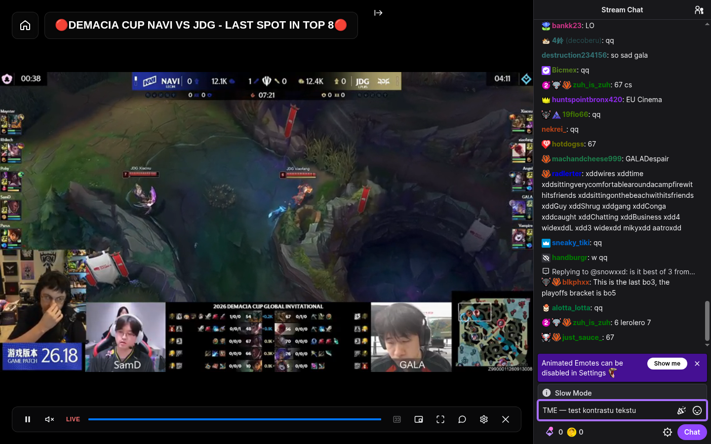

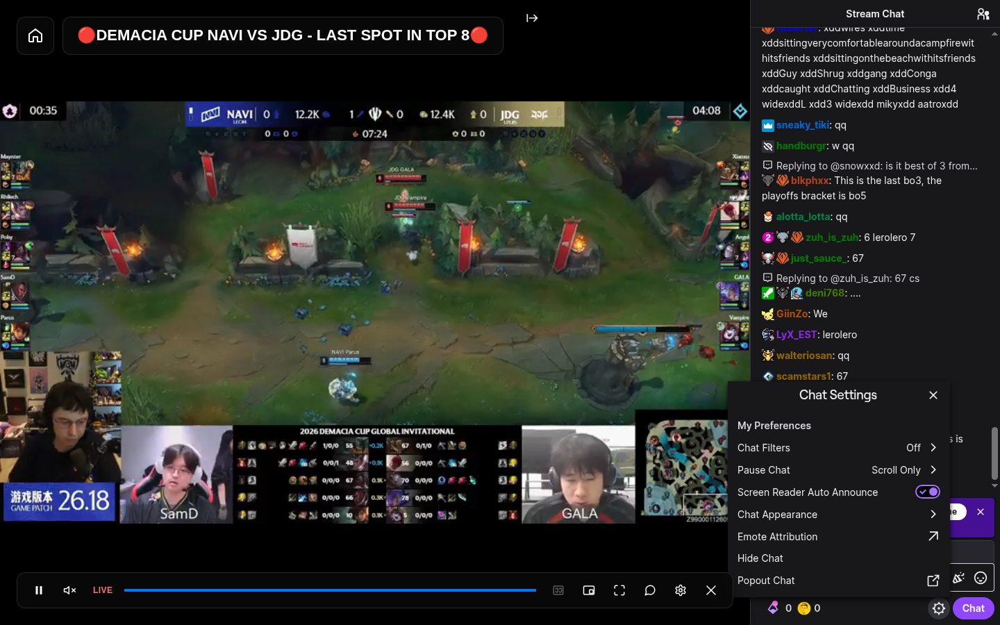

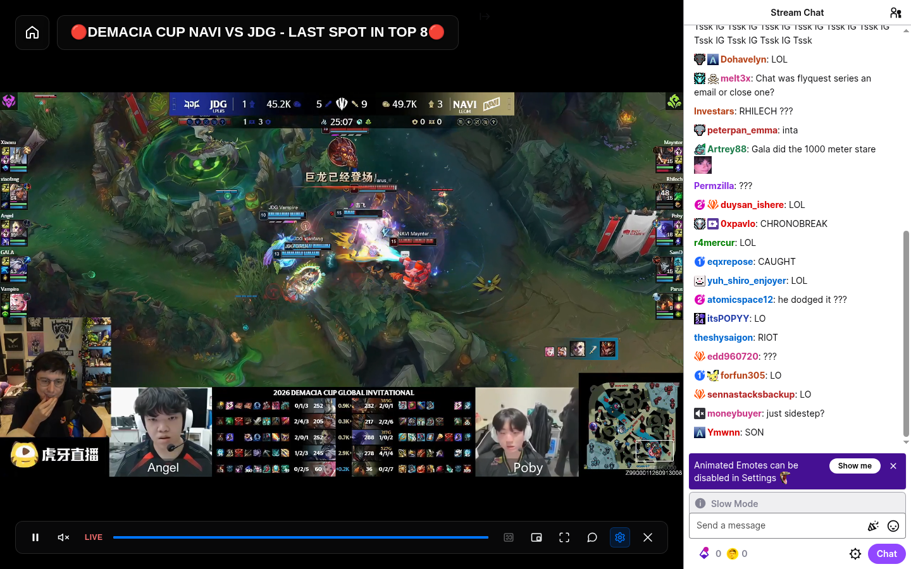

**YouTube zachowuje motyw wybrany w ustawieniach YouTube.** Przełącznik TME pokazuje „Ustawienia serwisu”, jest nieaktywny i ma widoczne wyjaśnienie. Starsze preferencje wymuszające jasny/ciemny są ignorowane podczas sesji i normalizowane przy kolejnym zapisie. Widoczność i szerokość działają nadal.

Przyczynę mieszanego wyglądu odtworzono na prawdziwym [YouTube Live](https://www.youtube.com/watch?v=1-LpQekNa9g). `setGlobalDarkTheme(true)` przełącza `html[dark]` i semantyczną paletę, ale bieżący `live_chat_base` zawiera także skompilowane aliasy kolorów `--t…` w `:root`, zależne od motywu wybranego przy ładowaniu dokumentu. Tło renderera, tekst Top chat i obszar logowania korzystają z tych aliasów. Wymuszenie samego ciemnego atrybutu oraz tła renderera mieszało dwie palety. Natywne przełączenie w menu YouTube ładuje inny arkusz i wymienia dokument czatu.

Usunięto częściowe wymuszanie YouTube i jego most w świecie strony. TME nie przeładowuje czatu ani nie zmienia preferencji YouTube. Pełne wymuszanie motywu niezależnego od ustawień serwisu wymaga osobnego rozwiązania i kwalifikacji; obecna wersja nie deklaruje tej funkcji.

Zrzuty YouTube poniżej pokazują **motywy wybrane natywnie w YouTube**, zachowane przez TME, a nie wymuszanie palety przez TME. Sesja wylogowana: pole edycji dostępne po zalogowaniu nie zostało zweryfikowane na serwisie. Poprzednie zrzuty z mieszaną paletą zastąpiono.

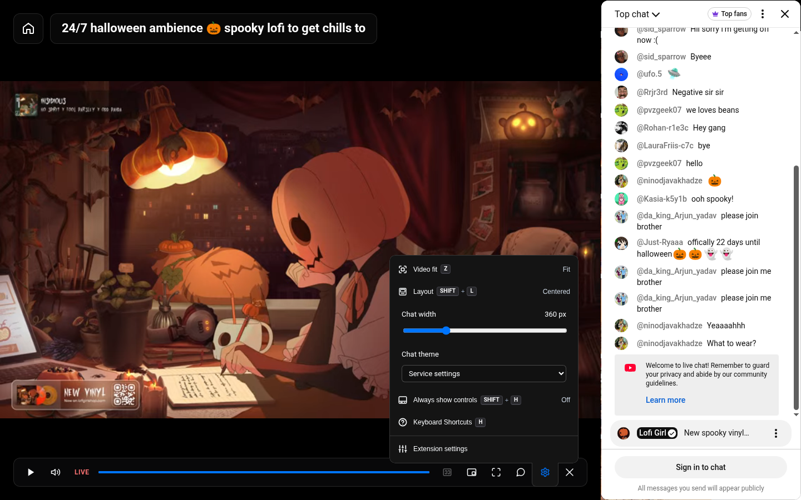

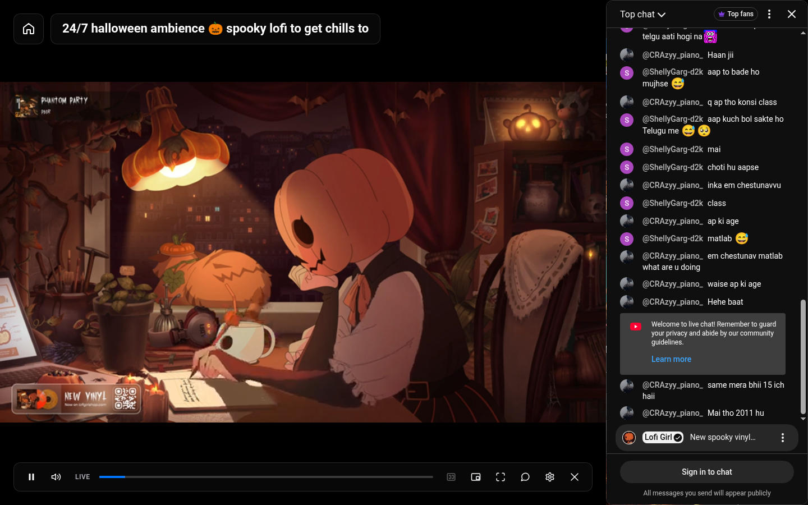

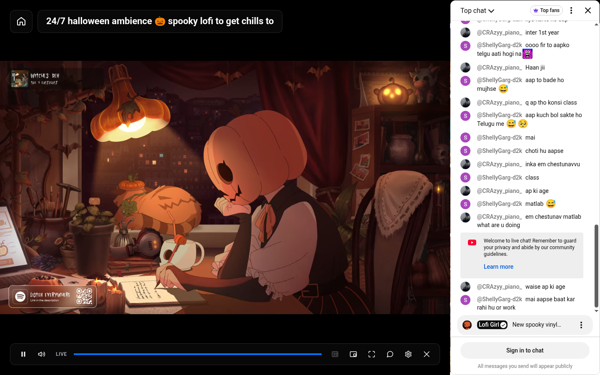

## Eksperymentalny patch motywu YouTube

[Analiza na żywym serwisie](youtube-chat-theme-patch.md) potwierdziła wykonalność niezależnego jasnego/ciemnego czatu przez dodatkową warstwę CSS. Bieżący wariant wymaga 38 aliasów (około 1,2 KB); pełna różnica palet obejmuje 116 aliasów (około 3,6 KB). Pomiary wybranych komponentów, menu, 20 zmian motywu, hide/show i przywrócenie przeszły bez wymiany dokumentu ani dodatkowego `load`. Pozyskiwanie obu aktualnych palet bez zmiany preferencji użytkownika pozostaje nierozwiązane. To prototyp badawczy poza paczką rozszerzenia; bieżące UI nadal respektuje ustawienia YouTube.

## Co pozostaje do kwalifikacji przed wydaniem

Weryfikacja automatyczna:

- `pnpm typecheck`, `pnpm build`, `pnpm verify:bundles`: sukces.
- 23 testy kontraktu i sesji czatu: sukces, bez pominiętych testów.
- `pnpm test` (równolegle): 474/476. Oprócz Netflixa test odliczania w `src/ui/service-actions.browser.test.ts:288` nie zmieścił się w tolerancji czasu. Ponowna kwalifikacja seryjna: 464/465, plus 11/11 testów `src/providers/service-actions.browser.test.ts` — łącznie 475/476, bez pominięć. Test odliczania i Bilibili przechodzą seryjnie bez zmian kodu; wcześniejszy obciążony przebieg miał także timeout Bilibili. Test Netflixa `boots at document_start and uses the attached signed-in session…` kończy się timeoutem w `src/ui/netflix-runtime.browser.test.ts:476`. Identyczny wynik odtworzono w osobnym katalogu na bazowym commicie `a79a5417b42ec6ea27b5f339afbd16714b14bee3`; nie jest to regresja czatu.
- Chromium smoke: sukces dla zainstalowanej paczki rozszerzenia. Weryfikuje istniejące przepływy playera i fullscreen na lokalnych fixtures.
- Firefox smoke: sukces w trybie diagnostycznym z wstrzykniętych paczek; Playwright nie ładuje niepodpisanego dodatku MV3. Nie stanowi kwalifikacji uprawnień ani natywnego czatu Firefox.
- Testy przeglądarkowe zgłaszają jawne pominięcie, jeśli Chromium nie jest zainstalowany. Wszystkie nowe testy wykonano lokalnie bez pominięć. Istniejący CI uruchamia główny zestaw przed instalacją Playwright; na świeżym runnerze te testy mogą być pominięte. Dodanie osobnego kroku po instalacji pozostaje do wykonania: GitHub odrzucił zmianę workflow z powodu braku uprawnienia `workflow` w połączeniu OAuth.

Automatyczne fixtures sprawdzają mechanikę rozszerzenia: cykl życia, tożsamość ramki, brak dodatkowego load, szkic wiadomości, skróty, IME, fokus i odzyskanie układu. Nie potwierdzają serwisowych funkcji.

Przed wydaniem nadal trzeba sprawdzić responsywny układ i pełny przebieg zmiany filtra YouTube, oba serwisy na zalogowanym koncie, moderację, natywne formularze monetyzacji, live/Premiere i rzeczywisty replay, fullscreen oraz Chrome i Firefox z zainstalowanym rozszerzeniem. Faktycznych płatności nie deklarujemy jako zweryfikowanych. Nowe embedy i integracja czatu obok playera na dowolnej stronie zewnętrznej pozostają osobnym etapem.

Zmiany DOM serwisów nie mają stabilnego kontraktu. Testy i zachowanie oryginalnej sesji ograniczają ryzyko, ale nie dają gwarancji zgodności z każdą przyszłą aktualizacją.
