# Natywny czat — implementacja i walidacja draft PR #25

[Draft PR #25](https://github.com/TomaszJanusz/Theater-Mode-Everywhere/pull/25) zachowuje istniejące czaty na stronach Twitch i YouTube, udostępnia chowanie, szerokość oraz niezależny motyw **Jasny / Ustawienia serwisu / Ciemny**. Zadanie: [TME-18](https://linear.app/privacybrand/issue/TME-18/czaty-twitch-i-youtube-natywna-integracja-chowanie-i-zachowanie-pelnej). [Opracowanie architektury](twitch-youtube-chat.md) opisuje szerszy zakres docelowy; nowe embedy na stronach zewnętrznych są osobnym etapem.

## Wspólny kod i adaptery

Adaptery detekcji w `src/chat/detect.ts` wskazują `ChatSurface`: oryginalny kontener, istniejącą ramkę, serwis, materiał, live/replay i przodków potrzebnych do prezentacji. Wiadomości i funkcje konta nadal obsługuje serwis. `ChatSurface` jest opisem istniejącego czatu, a nie rendererem wiadomości ani magistralą jego akcji.

Wspólny `ChatController` obsługuje widoczność, szerokość, układ, fokus i cykl życia. `src/ui/chat.ts` zapewnia jednakowe UI i zapis preferencji osobno dla Twitcha i YouTube. Panel jest po prawej od 900 px szerokości okna; poniżej znajduje się pod wideo. Szerokość bocznego panelu wynosi 280–600 px. Player, toolbar, HUD i napisy korzystają z pozostałego obszaru. Schowany kontener pozostaje w DOM, jest niewidoczny i `inert`.

`ChatThemeSession` wspólnie obsługuje zastosowanie wyboru, gotowość dokumentu, wymianę ramki, ponowne sprawdzenie palety oraz przywracanie zmian po wyborze „Ustawienia serwisu” lub wyjściu z TME. Dwa adaptery palety implementują ten sam kontrakt `apply(theme)` / `restore()`:

| Serwis | Jak stosowana jest paleta |
| --- | --- |
| Twitch | Adapter znajduje kompletną klasę natywnych tokenów w aktualnym CSS. Stosuje ją do czatu i portali oraz przełącza natywne flagi jasnego/ciemnego wyglądu. Wygenerowana nazwa klasy nie jest zapisana w TME. |
| YouTube | Adapter zmienia `dark` tylko w istniejącym dokumencie czatu i dodaje własny, usuwalny arkusz łączący 57 skompilowanych aliasów z natywnymi tokenami palety. Nie pobiera przeciwnego arkusza ani nie wywołuje lub podmienia funkcji YouTube. |

Oba serwisy mają aktywny przełącznik, również przy schowanym czacie i dolnym panelu. Wybór nie zmienia zapisanych ustawień wyglądu serwisu. Jeśli adapter nie rozpozna potrzebnej palety, usuwa wymuszenie i pozostawia natywny wygląd z wyjaśnieniem w UI; preferencja użytkownika pozostaje zachowana.

YouTube nie ma publicznego kontraktu tych aliasów. Rozpoznawanie sprawdza obecność obu palet, wymagane deklaracje i odwołania do znanych aliasów w CSS, także w deklaracjach skrótowych, oraz obsługę `color-mix`. Pełny odczyt aktualnego CSS wykazał **68 używanych aliasów: 57 różnic między motywami i 11 stałych kolorów**. Most nie zawiera własnych RGB/hex; jeden dawny token dla linii wątku jest odczytywany z natywnej jasnej deklaracji, którą nowy system YouTube nadpisuje na korzeniu. [Historia prototypów](youtube-chat-theme-patch.md) wyjaśnia wcześniejszy, niepełny pomiar 47/38.

## Warstwy i natywne menu

Natywne portale i dialogi mają warstwę nad TME. Obniżono warstwę playera i chrome TME tylko w sesji z wykrytym czatem. W łańcuchu przodków usuwane są także konteksty tworzone przez `view-transition-name` YouTube; samo `z-index: auto` nie wystarczało. CSS działa wyłącznie podczas TME i przywraca natywną prezentację po wyjściu.

Test przeglądarkowy umieszcza portale Twitcha, popup YouTube i dialog z backdropem **przed** hostem TME, nakłada je na jego przycisk ustawień i wideo, a następnie sprawdza trafienie i rzeczywiste kliknięcie. Osobny odczyt pikseli ramki wykrywa sytuację, w której czat istnieje i przyjmuje kliknięcia, ale pozostaje namalowany pod czarną sceną.

## Nowe zrzuty z prawdziwych serwisów

Wykonano 8 października 2026, w graficznym Chromium 153 przez Playwright/Xvfb, przy oknie 1440 × 900. Przeglądarka używała osobnego tymczasowego, wylogowanego profilu i **zainstalowanego `dist/chrome-unpacked`**. Zrzuty pokazują implementację rozszerzenia; nie wstrzykiwano prototypowej palety. Źródła: [YoungMulti live](https://www.twitch.tv/youngmulti) i [Rainy Porch Jazz live](https://www.youtube.com/watch?v=eao0EdKtvZg).

| Widok | Twitch | YouTube |
| --- | --- | --- |
| Menu opcji TME | 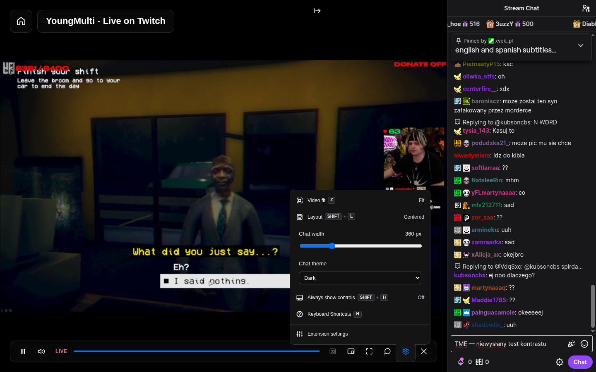 | 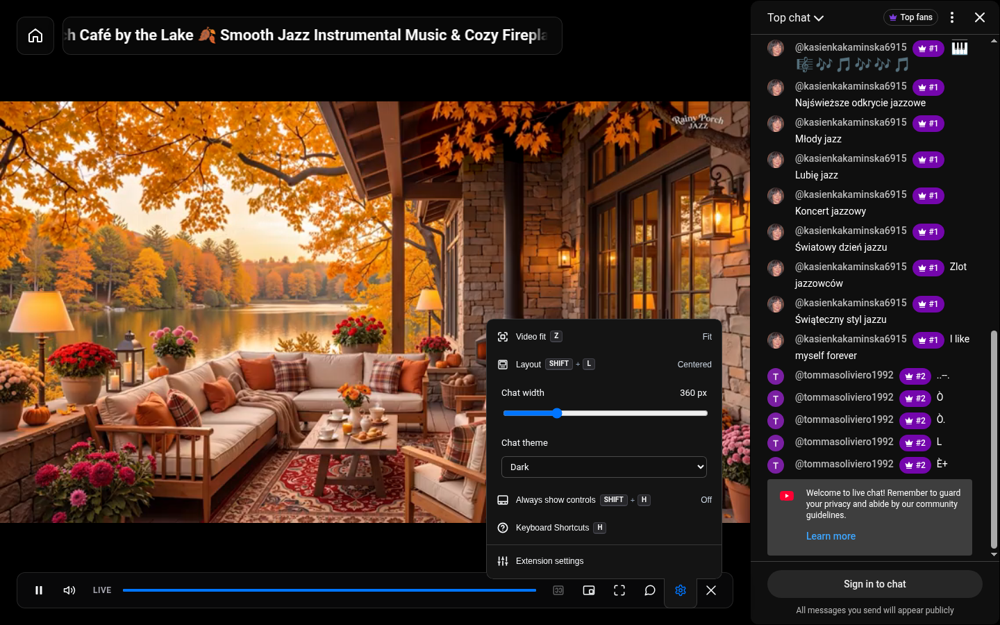 |
| Jasny czat | 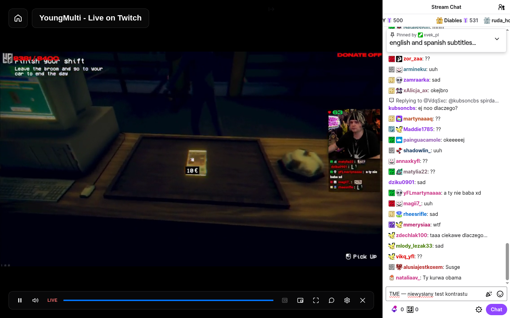 | 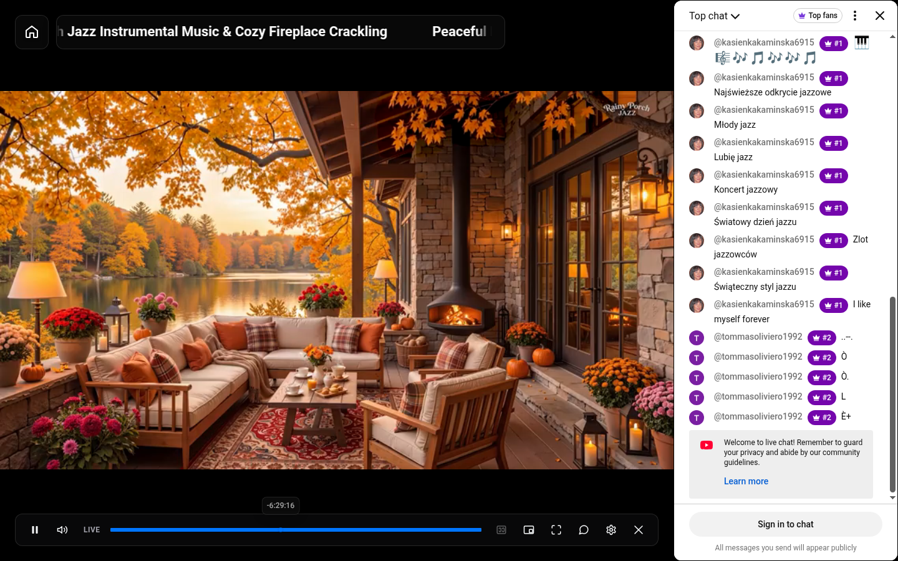 |
| Ciemny czat | 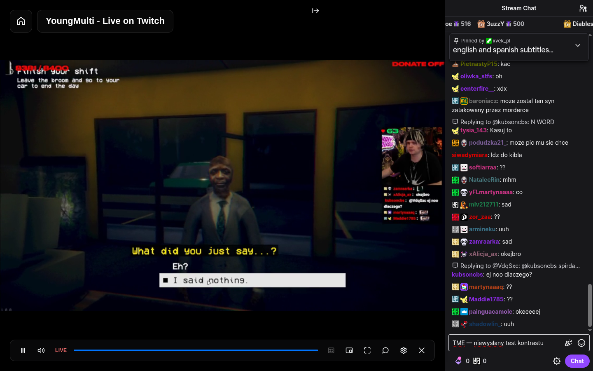 | 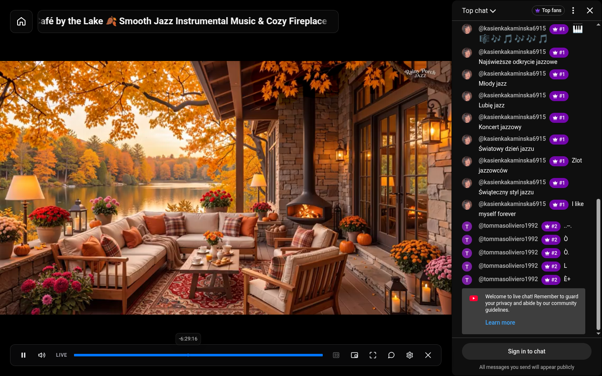 |
| Natywne menu | 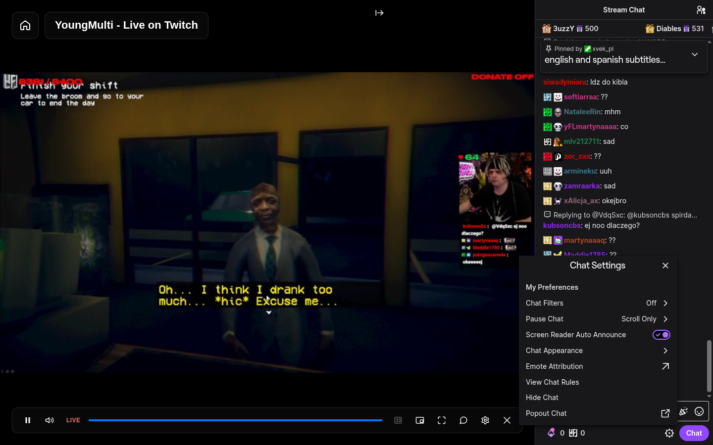 | 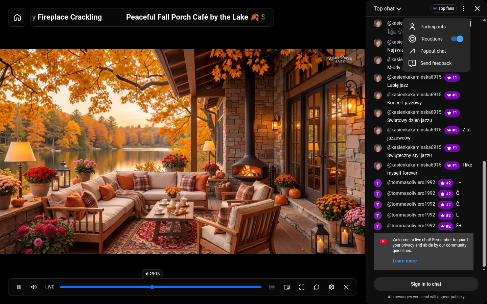 |
| Dodatkowe natywne UI | 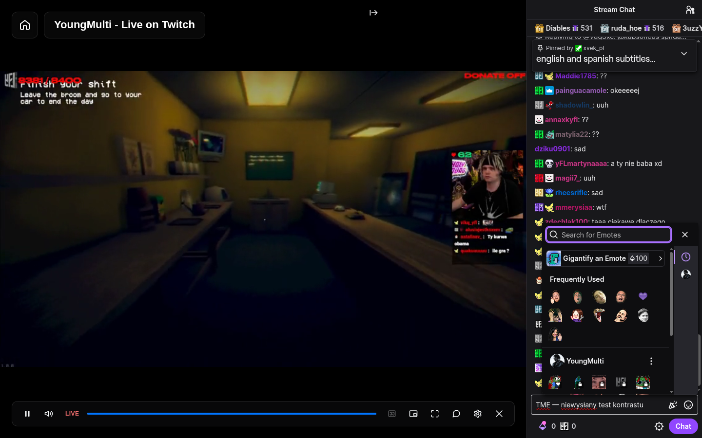 | 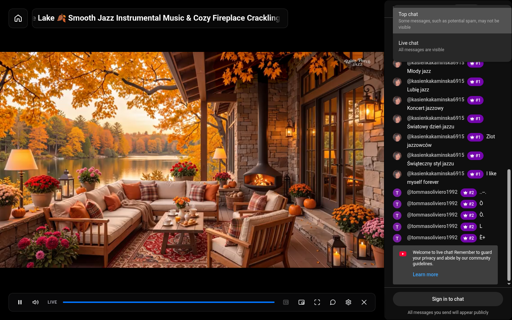 |
| Schowany czat | 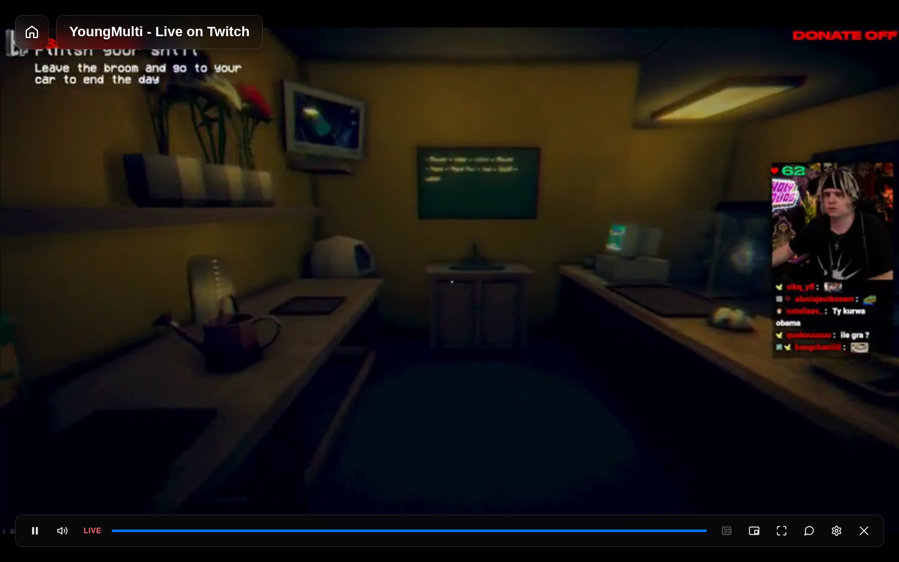 | 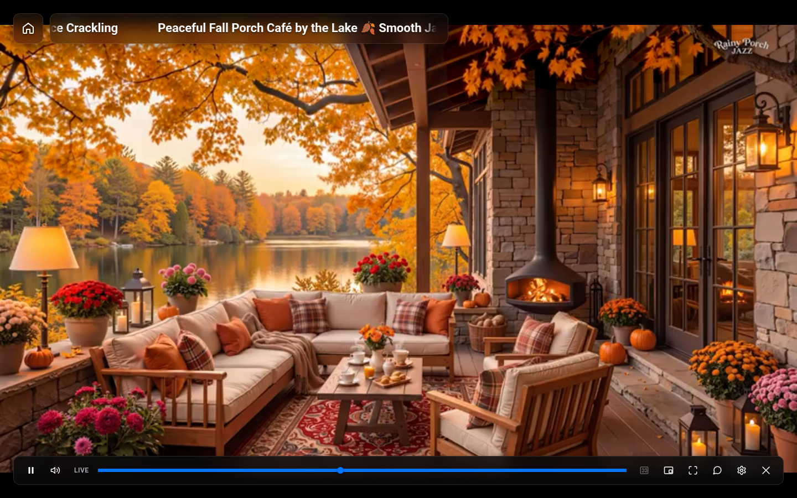 |

Dodatkowe warianty: [jasne opcje Twitcha](screenshots/current/twitch-options-light.png), [jasne menu Twitcha](screenshots/current/twitch-settings-light.png), [jasne opcje YouTube](screenshots/current/youtube-options-light.png), [jasne Top chat](screenshots/current/youtube-top-chat-light.png), [ciemny portal Chat Rules](screenshots/current/twitch-rules-dark.png) i [jasny Chat Rules](screenshots/current/twitch-rules-light.png). Wcześniejsze zrzuty i prototypy pozostają historycznym materiałem; powyższa galeria przedstawia bieżącą funkcję.

### Wyniki na serwisach

- **Twitch:** wymuszono dark → light → native. Tekst niewysłanego szkicu zmieniał się z `rgb(239, 239, 241)` na `rgb(14, 14, 16)`; panel odpowiednio `rgb(24, 24, 27)` / `rgb(255, 255, 255)`. Chat Settings było klikalne w trzech sprawdzonych punktach, także poza granicą panelu, nad wideo. Otwierał się natywny picker emotes oraz portal Chat Rules; jego przycisk był klikalny ponad TME. Hide/show i zmiany palety zachowały kontener, rodzica, edytor oraz szkic. Powrót do native odtworzył zmierzoną paletę początkową. Wideo podczas obu wariantów odtwarzało się (`readyState=4`).
- **YouTube:** wszystkie 68 kolorów aliasów zgadzało się z niezależnym natywnym punktem odniesienia w obu wariantach po normalizacji RGBA. Top chat otwierało się i przyjmowało trafienia w obu motywach; More options miało czytelne natywne pozycje Participants, Reactions, Popout chat i Send feedback. Przełączenia i hide/show zachowały ten sam iframe i dokument, dodatkowe `load`: **0**. Główna strona pozostała jasna również przy ciemnym czacie. Powrót do native usunął most i odtworzył pierwotną flagę. Przed każdym z ośmiu zrzutów potwierdzono odtwarzanie wideo (`readyState=4`, `paused=false`).

[Pomiary towarzyszące zrzutom](screenshots/current/verification.json) zawierają wyniki palet, tożsamości, hit testingu i odtwarzania. Nie wysłano wiadomości, nie kupowano produktów ani nie wykonywano moderacji. Edytor YouTube wymaga logowania i na prawdziwym serwisie pozostaje niezweryfikowany; jego kontrast, szkic i zachowanie klawiatury sprawdzają fixtures.

## Testy i pozostała kwalifikacja

- `pnpm typecheck`, `pnpm build`, `pnpm verify:bundles`: sukces.
- Testy URL, geometrii, kontrolera i UI czatu oraz lokalizacji: **28/28**, bez pominięć; w tym **25 testów czatu**.
- Pełny `pnpm test`: **477/478**, bez pominięć. Jedyny błąd to timeout istniejącego testu Netflixa `boots at document_start and uses the attached signed-in session…`, `src/ui/netflix-runtime.browser.test.ts:476`. Ten timeout odtworzono wcześniej także na bazowym `main` (`a79a5417b42ec6ea27b5f339afbd16714b14bee3`). Zestaw nie jest w całości zielony.
- Fixtures sprawdzają obie natywne palety YouTube i wszystkie 68 aliasów, kontrast edytora, zachowanie szkicu i klawiatury/IME, ukrywanie, zmianę dokumentu, przywracanie, fallback przy nieznanym aliasie w skrótowym `border-color` i odzyskanie palety po jego usunięciu. Nie zastępują testów serwisowych funkcji konta.
- Wcześniejszy Chromium smoke przeszedł dla zainstalowanego rozszerzenia; Firefox smoke był diagnostyką z wstrzykniętych paczek. Nowy most palety nie ma jeszcze kwalifikacji na prawdziwych serwisach w Firefox.
- CI uruchamia główny zestaw przed instalacją Playwright, więc na świeżym runnerze testy przeglądarkowe mogą zostać pominięte. Osobny krok po instalacji pozostaje do dodania; wcześniejszą zmianę workflow GitHub odrzucił z powodu braku uprawnienia `workflow` w połączeniu OAuth.

Przed wydaniem potrzebna jest kwalifikacja na zalogowanych kontach, moderacji, formularzy monetyzacji, rzeczywistego replay/Premiere, fullscreen, pełnej zmiany filtra i responsywnego układu YouTube oraz Chrome/Firefox. Zachowanie natywnego DOM ogranicza ingerencję, lecz nie gwarantuje każdej funkcji ani zgodności z przyszłymi zmianami prywatnego CSS serwisów.
