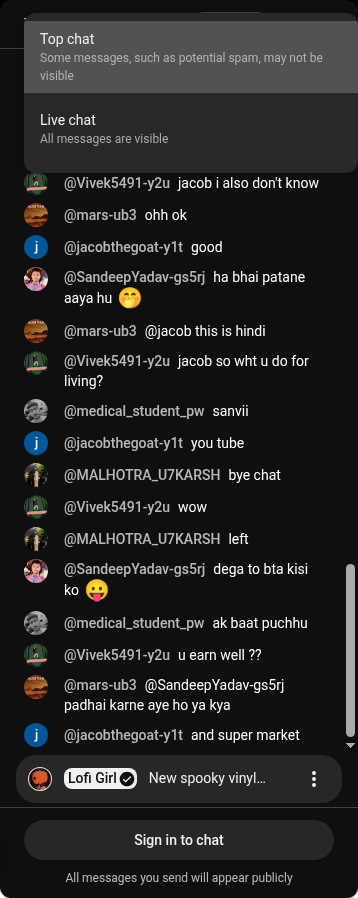
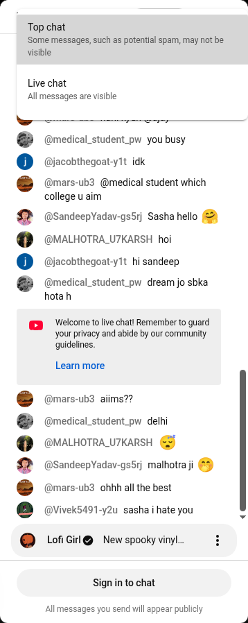
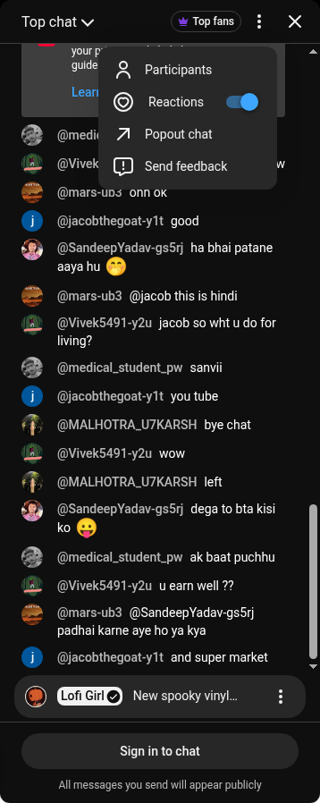

# YouTube: złożoność niezależnego motywu czatu

**Wynik: niezależny motyw da się uzyskać małym patchem CSS, lecz odporne pozyskiwanie palety pozostaje nierozwiązane.** Prototyp odtworzył zmierzone kolory natywnego motywu bez przeładowania ramki i bez podmieniania funkcji YouTube. To odwracalny eksperyment; draft PR #25 nadal zachowuje ustawienia YouTube, a wymuszanie udostępnia na Twitchu.

## Pomiar na prawdziwym serwisie

Test wykonano 8 października 2026 na [Lofi Girl Live](https://www.youtube.com/watch?v=1-LpQekNa9g), w graficznym Chromium 153 przez Playwright/Xvfb. Osobny profil był wylogowany i miał zainstalowane rozszerzenie z commita `05fb0022c1e32d96475864d26e01b16f9a11dac1`. Nie korzystano z konta użytkownika. Przeglądarka T3 nie otrzymała działającego czatu od YouTube; pomiary dotyczą osobnego Chromium.

Obie palety pozyskano przez rzeczywiste menu Appearance YouTube w tymczasowym profilu. W tym etapie serwis sam wymienia dokument i arkusz czatu. Dopiero potem testowano niezależne przełączanie przez prototyp w pojedynczym istniejącym dokumencie. To dwa różne etapy.

| Element bieżącego arkusza | Pomiar |
| --- | --- |
| Wygenerowane aliasy kolorów w każdym motywie | 133 |
| Aliasy o różnych wartościach wynikowych light/dark | 116 |
| Aliasy, do których odwołuje się załadowany CSS | 47 |
| Różniące się aliasy używane przez ten CSS | 38 |
| Patch tych 38 aliasów | jasny: 1202 B; ciemny: 1229 B |
| Patch wszystkich 116 różnic palety | jasny: 3599 B; ciemny: 3629 B |
| Reguła prototypu | jedna `:root:root:root` |

Liczba odwołań dotyczy arkuszy, także komponentów jeszcze niewidocznych. Nie jest liczbą elementów na ekranie ani dowodem pokrycia wszystkich funkcji.

YouTube łączy semantyczne zmienne przełączane przez `html[dark]` z wygenerowanymi aliasami `--t…`, których wartości są skompilowane dla motywu przy ładowaniu arkusza. Samo `setGlobalDarkTheme` nie wymienia drugiej grupy. Prototyp wywołuje istniejącą metodę i dodaje wartości aliasów odczytane z rzeczywistego przeciwnego motywu.

Pierwsza próba z regułą `:root` pozostawiła jasne obramowanie Top fans. Natywny arkusz ma dodatkową regułę `:root:root` z sześcioma nadpisaniami. Odczyt ostatniej deklaracji z CSSOM nie wystarcza: paletę trzeba zebrać przez `getComputedStyle`. Po uwzględnieniu kaskady i silniejszej reguły różnica zniknęła. Nie użyto `!important`, filtrów odwracania obrazu ani własnych kolorów poszczególnych rendererów.

## Wyniki prototypu

- Przełączenie light → dark i dark → light zachowało przeciwny motyw głównego dokumentu. Wymuszanie nie zmieniało preferencji YouTube.
- Kolory tła, tekstu, obramowania, fill i stroke dziesięciu obecnych punktów pomiaru zgadzały się z natywnym motywem. Badano renderer, nagłówek, Top chat, obszar logowania, Top fans, zwykłą wiadomość, autora, ikonę, menu filtra i komunikat serwisu. To próbka komponentów.
- Menu Top chat otwierało się w obu motywach. Później otwarte More options miało natywne ciemne tło `rgb(40, 40, 40)` i jasny tekst pozycji `rgb(241, 241, 241)`. Dostępne były Participants, Reactions, Popout chat i Send feedback; nie uruchamiano tych działań.
- Wykonano 20 kolejnych zmian motywu i łącznie dziesięć cykli schowaj/pokaż przez TME. Ten sam iframe, dokument i źródło; dodatkowe zdarzenia `load`: 0.
- Usunięcie arkusza i przywrócenie flagi odtworzyło zmierzone kolory początkowego motywu w obu kierunkach. Natywnej metody nie podmieniano.
- Wariant 116 różnic również zgadzał się z ciemnym punktem odniesienia. Pokrywa więcej tokenów, lecz nie dowodzi działania nieotwartych formularzy.
- Załączony helper uruchomiono na tym samym żywym czacie. Przełączenie i przywrócenie również nie miały różnic w badanych punktach.

[Pomiary JSON](prototypes/youtube-chat-theme-results.json) zawierają źródła arkuszy, kolory i sprawdzenia. [Kod prototypu](prototypes/youtube-chat-theme.mjs) ma 77 linii i nie trafia do paczki rozszerzenia. Funkcje `capturePalette` i `applyPalettePrototype` można wykonać przez `frame.evaluate` w świecie strony; uchwyt umożliwia `setTheme` oraz `restore`. Wymaga dwóch wcześniej pozyskanych natywnych palet z tej samej wersji CSS. Nie pobiera ich dla użytkownika.

Zrzuty przedstawiają **eksperymentalny CSS w istniejącym czacie**, a nie funkcję w ustawieniach TME. Są wycinkami ramki z prawdziwej strony. Odtwarzanie wideo nie było przedmiotem tego pomiaru.

## Złożoność wdrożenia i utrzymania

| Warstwa | Ocena | Powód |
| --- | --- | --- |
| Korekta kolorów dla poznanej wersji | mała | Jedna reguła, 38–116 deklaracji, istniejąca metoda serwisu. |
| Cykl życia w rozszerzeniu | średnia | Świat strony, gotowość komponentu, wymiana dokumentu, własność CSS, przywracanie i odrzucanie spóźnionych wyników. |
| Pozyskiwanie obu aktualnych palet | duża, nierozwiązana | Dokument zawiera paletę wybranego motywu. Prototyp uzyskał drugą przez zmianę ustawień w tymczasowym profilu. |
| Odporność na aktualizacje i eksperymenty | duża | Tokeny, warianty i priorytety nie mają publicznego kontraktu; potrzebne sprawdzanie kompletności i powrót do natywnego wyglądu. |
| Wspólne UI i układ Twitch/YouTube | mała dodatkowa zmiana | Kontroler ma motyw, widoczność, szerokość i cykl życia. Strategia YouTube może współdzielić ten interfejs. |

Wklejenie 38 hashy do kodu będzie małe, ale uzależni funkcję od obecnego builda. Patch 116 różnic jest ostrożniejszy wobec później ładowanych komponentów. Oba wymagają pary palet dla właściwej wersji i wariantu CSS.

Nie ustalono stabilnego sposobu otrzymania przeciwnego arkusza z bieżącego dokumentu. Jego adres generuje serwis; zależy także od wariantu konfiguracji. Ręczna modyfikacja bitów URL, zmiana preferencji YouTube w tle albo przeładowanie oryginalnej ramki nie spełnia celu zachowania sesji. Dopasowanie aliasów po samym kolorze jest niejednoznaczne: wiele ról ma w jednym motywie tę samą wartość, a rozchodzi się w drugim.

`ChatController` i UI mogą pozostać wspólne. Adapter YouTube potrzebowałby dostawcy palet, sprawdzenia wersji/kompletności, obsługi świata strony oraz sesji konkretnego dokumentu. Po nieznanym buildzie lub błędzie powinien zachować natywny motyw i pokazać rzeczywistą dostępność opcji. Nie wymaga własnego klienta wiadomości.

**Rekomendacja:** obecny draft pozostawić z natywnym motywem YouTube. Przed włączeniem niezależnych motywów rozwiązać pozyskiwanie palet i zakwalifikować zalogowany edytor, emoji, moderację, monetyzację, replay i warianty przeglądarek. Sesja wylogowana nie udostępniła rzeczywistego edytora; kolor wpisywanego tekstu pozostaje niezweryfikowany. Otwarcie menu nie potwierdza przepływu zmiany filtra ani wszystkich funkcji.
