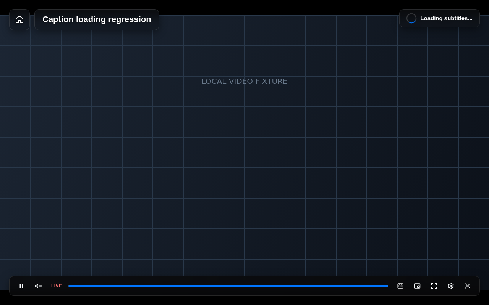
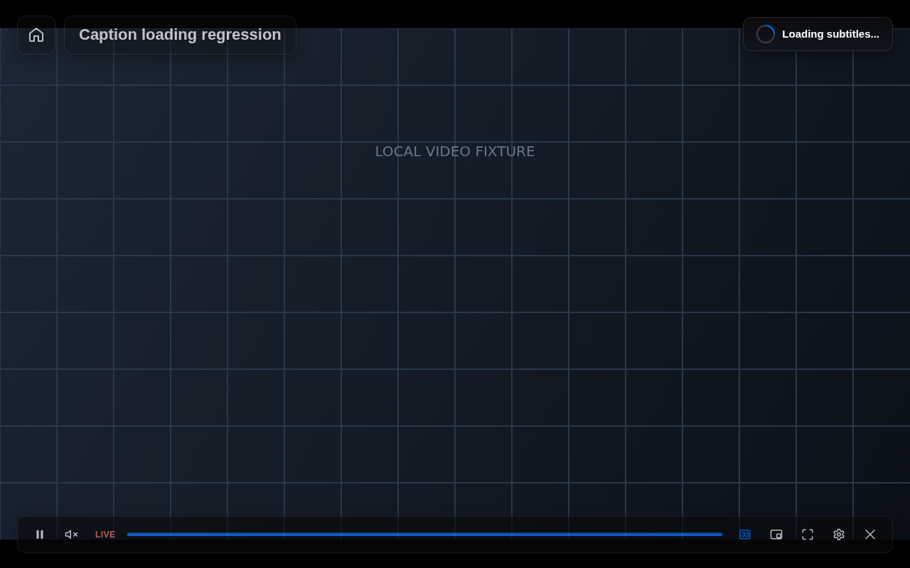
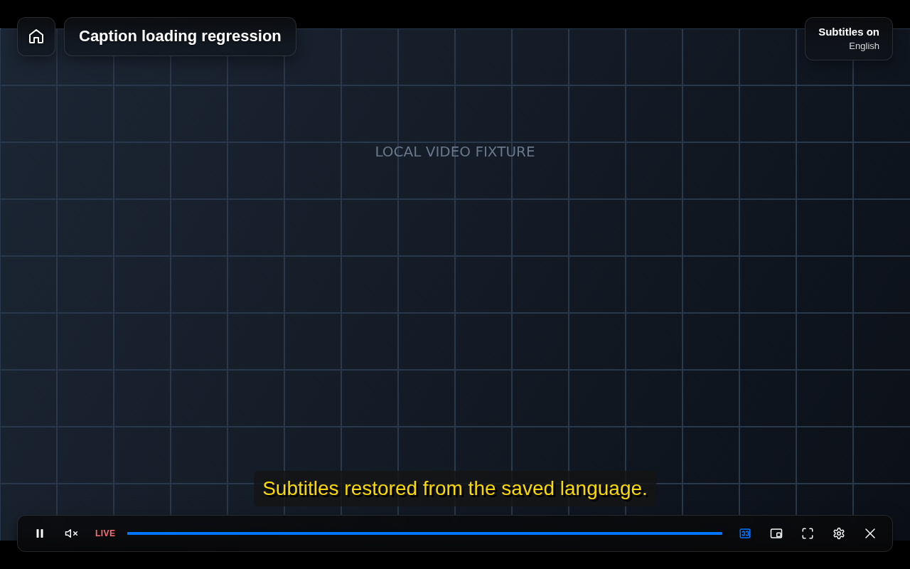
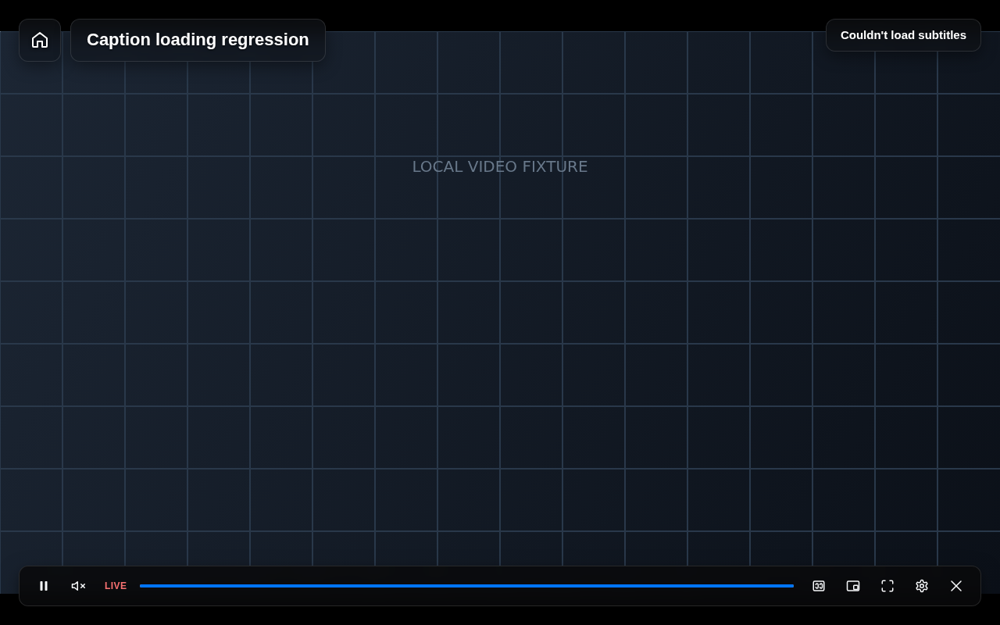

# Subtitle loading review

The review covers every production caller of `activateCaptionTrack` and the Disney+ cue-window refresh path. Track discovery reads available languages and metadata; activation and window requests load or enable the selected captions.

## Findings and completed work

- [x] Saved-language restoration used `hud: 'on'`, which omitted the loading spinner and suppressed failures. Removed the optional HUD policy: every caption activation now publishes loading and a result.
- [x] Programmatic `activate(id)` calls could silently load captions when no HUD option was supplied. They now use the same operation as menu selection and keyboard toggling.
- [x] Disney+ downloaded caption windows through a separate result/failure path without loading feedback. It now prepares a lazy request and passes it through the shared operation. Loaded windows, including the final cached segment, return no request and show no loading UI.
- [x] A rejected window request only logged an error and left captions marked active. The shared operation now deactivates failed captions, clears their cues/layout, and reports the failure.
- [x] Invalidation, media changes, adapter replacement and disposal could leave a spinner visible or let stale completion events replace the current HUD. These transitions dismiss loading immediately; stale results and queued selections cannot publish a result for another lifecycle.
- [x] Successful host-delivered restoration was retried because success was tested using `usingOverlayCaptions`. Retries now follow a failed activation, and a newer user request cancels the pending retry.
- [x] Native `textTracks` events could trigger automatic restoration immediately after a failed manual language selection, overwriting its error. Restoration is now an explicit pending intent for the media/track lifecycle, rather than an effect of every metadata refresh.
- [x] The CC icon now pulses from white to the configured accent while the shared caption state is `loading`. `aria-busy` follows that state; reduced motion shows a steady accent instead of pulsing.

The provider boundary is documented in [player-provider-contracts.md](player-provider-contracts.md). Providers own downloads, retries within a download, parsing and caching. The controller owns request serialization, loading UI, result application, preferences, layout and cancellation feedback.

## Verification and screenshots

Controller regressions cover manual activation, toggling, saved-language restoration, cancellation, stale queues, host-delivered success, cue-window success/no-op/failure and metadata events after a failed selection. Browser tests run the production player runtime with a delayed native VTT response, measure both animation endpoints, check reduced motion, select a failing language, and exercise the real Disney adapter/composite with routed HLS/VTT responses.

The screenshots show the production player on a deterministic local canvas video fixture, with mocked extension settings and controlled network responses. They are not captures from a signed-in streaming service.

Local validation: `pnpm typecheck`, `pnpm build`, `pnpm verify:bundles` and all 50 controller/caption browser regressions passed. Chromium smoke with `THEATER_SMOKE_SHORTCUTS_ONLY=1` passed, including installed-extension startup, video switching, shortcut management, fullscreen/help, blacklist and iframe behavior.

Two full-suite checks timed out locally: Netflix document-start session discovery in `src/ui/netflix-runtime.browser.test.ts:476`, and full Chromium smoke waiting for controls to detach after Escape in `scripts/smoke.ts:717`. Both failures were reproduced on the unchanged `main` at `3eb6747`; the full suite and unrestricted smoke are not reported as passing.

Reproduce them with:

```sh
CAPTION_SCREENSHOT_DIR=docs/screenshots/subtitle-loading pnpm exec tsx --test src/ui/caption-loading.browser.test.ts
```

Loading, white phase:



Loading, accent phase:



Successful restoration:



Failed language selection:


